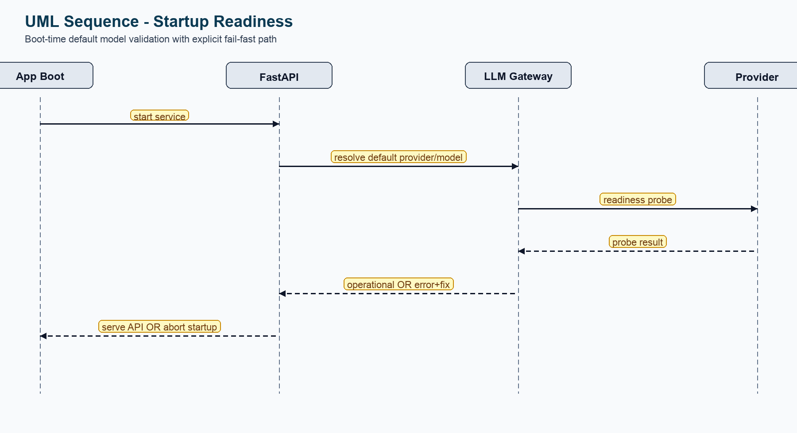
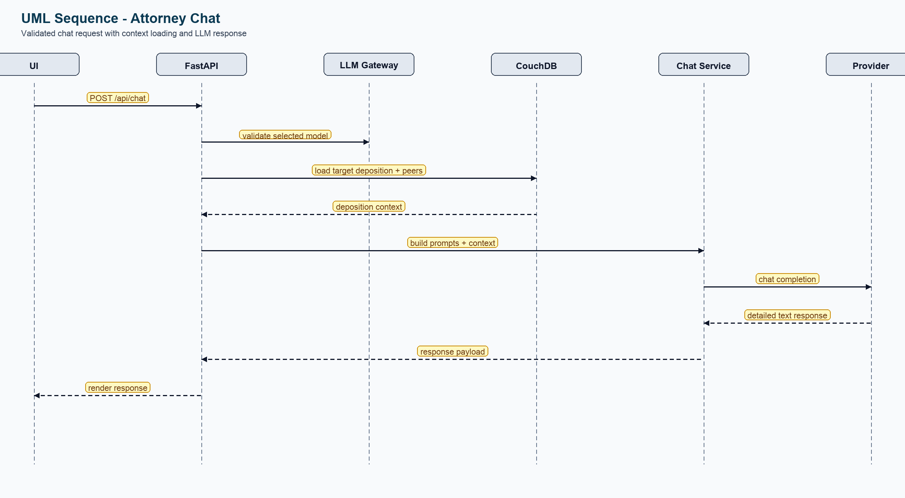
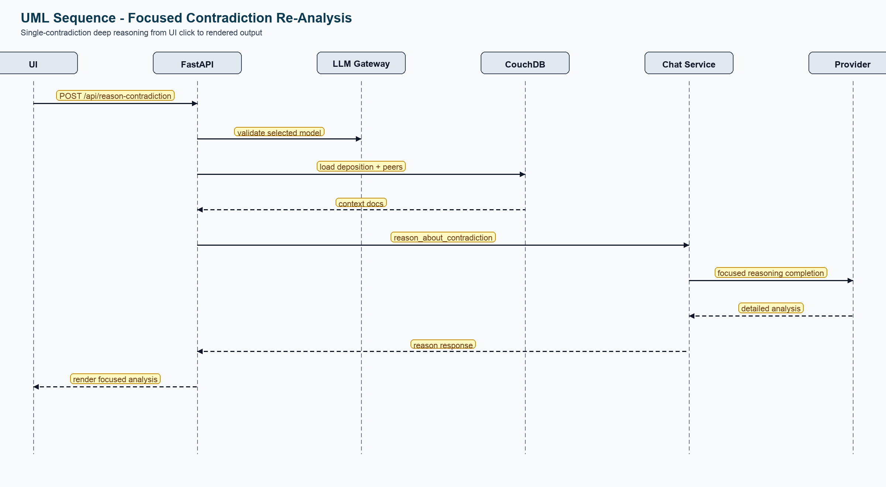

# Legal Deposition Analysis Demo

This demo ingests unstructured deposition `.txt` files for a case, maps each one into a deposition schema, stores it in CouchDB, evaluates contradictions across depositions, and exposes an interactive UI with risk scoring and attorney chat.

## Ollama Setup (Download Local LLMs)

Use these steps before running the app if you want local models through Ollama.
This project is tuned for legal-focused models; prefer legal models over general-purpose models.

1. Install Ollama:
```bash
brew install --cask ollama
```

2. Start Ollama:
```bash
ollama serve
```

3. Pull legal-focused local models (recommended):
```bash
ollama pull initium/law_model:latest
# if :latest is unavailable in your Ollama registry, use:
ollama pull initium/law_model:Q2_K
```

4. Verify downloaded models:
```bash
curl http://localhost:11434/api/tags
```

5. Configure `.env` for this app:
```bash
# If running API on host:
OLLAMA_URL=http://localhost:11434

# If running API in Docker Compose:
OLLAMA_URL=http://host.docker.internal:11434

OLLAMA_DEFAULT_MODEL=initium/law_model:latest
OLLAMA_MODELS=initium/law_model:latest,initium/law_model:Q2_K
DEFAULT_LLM_PROVIDER=ollama
```

6. Rebuild/restart the app after `.env` changes:
```bash
docker compose up --build -d
```

7. In the UI, click `Refresh Models` and choose an `Ollama - <model>` entry from the `LLM` dropdown.

8. Startup behavior:
   - The API fails fast if the default LLM cannot be reached at boot.
   - The startup error includes `Possible fix:` guidance.

## Workflow (LangGraph)

1. **Node 1 (Seasoned Law Clerk)**
   - Reads raw `.txt` deposition.
   - Extracts structured deposition schema using the selected LLM (default: `ChatGPT 5.2`, `MODEL_NAME=gpt-5.2`).
   - Saves mapped deposition to CouchDB.

2. **Node 2 (Seasoned Attorney)**
   - Compares the mapped deposition to other depositions in the same case.
   - Flags contradictions and assigns a `contradiction_score` (0-100).
   - Persists contradiction findings back to CouchDB.

## UML Diagrams

The UML set is sequence-diagram only.

### 1. Startup Readiness Sequence



Shows boot-time default model validation and fail-fast behavior.

### 2. Ingest Case Sequence


Shows ingest flow from folder selection through mapping, contradiction assessment, and persistence.

### 3. Attorney Chat Sequence



Shows chat request validation, context loading, LLM call, and UI response rendering.

### 4. Focused Contradiction Re-Analysis Sequence



Shows single-contradiction deep re-analysis from click to returned explanation.

To regenerate UML PNGs:

```bash
python scripts/generate_uml_diagrams.py
```

## Features

- Batch ingest all `.txt` files in a directory.
- Numeric contradiction risk scores per deposition (0-100), sorted highest-first.
- Scrollable deposition timeline with forward/back controls.
- Per-deposition contradiction details.
- Overall short-answer conflict summary plus clickable detail bullets for focused re-analysis.
- Attorney chatbot to explain conflicts and discuss possible actions.
- Runtime LLM switcher in the UI (ChatGPT or local Ollama models) for ingest, contradiction reasoning, and chat.
- Persistent case index in CouchDB with a vertical case browser in the UI.
- LangGraph execution memory snapshots and chat/reason events persisted per case.
- Case lifecycle APIs and UI actions to create, rename, browse, and remove cases.
- Graph RAG foundation with Neo4j: load legal ontology `.owl` files and browse graph structure.
- Hard startup guard: API will not start unless the default configured LLM is operational.
- Optional fast-ingest mode to skip full-case reassessment and return results sooner.

## Tech Stack

- FastAPI backend
- LangGraph + LangChain OpenAI
- CouchDB storage
- Neo4j graph store (Graph RAG ontology layer)
- Vanilla JS/CSS frontend
- Docker Compose for full local stack

## Quick Start (Docker Compose)

1. Configure environment:

```bash
cp .env.example .env
# required: set OPENAI_API_KEY
# optional: set DEPOSITION_DIR to a host folder with .txt files
# optional: set DEPOSITION_EXTRA_DIRS (comma-separated extra roots)
# optional: change API_PORT / COUCHDB_PORT if 8000 or 5984 are in use
```

2. Build and start everything:

```bash
docker compose up --build -d
```

3. Open the app:

- UI: `http://localhost:8000` (or your configured `API_PORT`)
- CouchDB: `http://localhost:5984/_utils` (or your configured `COUCHDB_PORT`)
- Neo4j Browser: `http://localhost:7474/browser/` (or your configured `NEO4J_HTTP_PORT`)

## AWS EKS (Kubernetes + GPU Ollama)

For production-style deployment on AWS with Kubernetes and GPU-backed Ollama:

- EKS cluster template: `deploy/eks/cluster.eksctl.yaml`
- Kubernetes manifests: `deploy/k8s/aws`
- End-to-end runbook: `deploy/k8s/aws/README.md`

Helper scripts:

- `scripts/aws/create_eks_cluster.sh`
- `scripts/aws/build_and_push.sh`
- `scripts/aws/deploy_k8s.sh`

## UI

1. Far-left panel: `Case Index`.
   - Vertical scroll list of all saved cases.
   - `Refresh Cases` action.
   - Click any case row to load that case into the dashboard.
2. Top-middle panel: case controls (`Case ID`, deposition folder, ingest, refresh, status).
   - Includes a single `Deposition Folder` text input with suggestions (type any path or pick discovered folders), an `LLM` dropdown, `Save Case`, `Refresh Models`, `Fast ingest mode`, and `Thought Stream (live)` toggle.
   - `Refresh Case` clears all currently saved deposition documents for the selected `Case ID` (so you can start that case clean before re-ingest).
3. Top-right panel: chronological deposition timeline with `Back` / `Forward` horizontal scrolling, plus a risk score list showing each deposition’s numeric contradiction score.
4. Bottom-middle panel:
   - With `Thought Stream` OFF (default): `Conflict Detail` appears as normal.
   - With `Thought Stream` ON: `Thought Stream` appears above `Conflict Detail`.
   - Thought Stream viewer is a sliding window (`Older` / `Newer`) over thought-stream events.
5. Bottom-right panel: attorney chat that responds in short-answer + bullet-detail format.
6. Thought stream (live stream):
   - Running ingest or chat starts a live thought-stream session and streams updates into `Thought Stream` in near real time.
   - Thought Stream includes prompts, input previews, output previews, and notes for `Persona:Legal Clerk` and `Persona:Attorney`.
   - Thought Stream is read-only in the UI.
   - Thought Stream is a visible process log from app instrumentation; it is not hidden model chain-of-thought.
7. Graph RAG controls (middle panel under status):
   - `Graph Ontology (*.owl)` path selector (dropdown suggestions + manual path entry)
   - `Browse` opens a file-browser style picker for ontology folders/files under `ONTOLOGY_DIR`
   - `Load Ontology` to import ontology triples into Neo4j
   - `Graph RAG Question` + `Ask Graph RAG` runs retrieval from Neo4j ontology and answers with the selected LLM
   - `RAG Processing (Neo4j retrieval)` toggle turns retrieval on/off per Graph RAG query
   - `RAG Stream` toggle turns rag-stream persistence on/off per query (captures RAG input, prompts, and output when enabled)
   - `Graph Retrieval Monitor` shows per-cycle retrieval terms, retrieved resource rows (nodes/relations/literals), context sent to LLM, and prompt payload used for inference
   - `Open Graph Browser` opens Neo4j Browser with a starter node/relationship query preloaded
   - Every Graph RAG cycle is persisted to CouchDB database `rag-stream` (`type=rag_stream`)

## Graph RAG (Neo4j + OWL)

This app includes a Graph RAG path that:

1. Loads legal ontology `.owl` files into Neo4j.
2. Retrieves graph context for each question.
3. Sends that context to the selected LLM.
4. Returns a grounded answer plus retrieval telemetry.
5. Optionally logs each cycle into CouchDB `rag-stream`.

### Graph RAG Environment

```bash
# If API runs in Docker Compose:
NEO4J_URI=bolt://neo4j:7687

# If API runs directly on host:
# NEO4J_URI=bolt://localhost:7687

NEO4J_USER=neo4j
NEO4J_PASSWORD=password
NEO4J_DATABASE=neo4j
NEO4J_BROWSER_URL=http://localhost:7474/browser/
ONTOLOGY_DIR=./ontology
RAG_STREAM_DB=rag-stream
```

Notes:

- Docker Compose mounts `ONTOLOGY_DIR` into the API container as `/data/ontology`.
- `ONTOLOGY_DIR` can contain one `.owl`, many `.owl`, or nested ontology folders.
- Local sample ontology content is included under `ontology/`.

### Ontology Inputs Supported

`Load Ontology` accepts any of the following:

- Single file path: `/data/ontology/LMSS-main/LMSS.owl`
- Folder path: `/data/ontology/LMSS-main`
- Glob path: `/data/ontology/**/*.owl` (or `/data/ontology/*.owl`)

The loader resolves and imports all matching `.owl` files.

### UI Workflow (End to End)

1. Confirm Neo4j is reachable (`/api/graph-rag/health` or UI status).
2. In `Graph Ontology (*.owl)`, choose a path:
   - type directly, or
   - click `Browse` to pick a folder/file with the ontology browser.
3. Click `Load Ontology`.
4. Optionally click `Open Graph Browser` to inspect graph nodes/relationships.
5. Enter a question in `Graph RAG Question`.
6. Set toggles:
   - `RAG Processing` ON: retrieve Neo4j context for inference.
   - `RAG Processing` OFF: no retrieval; LLM answers without graph grounding.
   - `RAG Stream` ON: persist per-cycle retrieval/prompt/answer telemetry to `rag-stream`.
7. Click `Ask Graph RAG`.
8. Review:
   - final answer,
   - retrieval monitor (terms, resources, context preview, prompts),
   - optional persisted stream events in CouchDB.

### RAG Toggle Behavior

- `RAG Processing = ON`
  - App retrieves graph resources and builds context.
  - `context_rows` reflects retrieved rows.
  - monitor payload includes retrieved resources/relations/literals.
- `RAG Processing = OFF`
  - Retrieval is skipped.
  - `context_rows` is `0`.
  - monitor context explicitly states RAG was disabled.
- `RAG Stream = ON`
  - Completed/failed cycles are saved to `RAG_STREAM_DB` as `type=rag_stream`.
- `RAG Stream = OFF`
  - Query still works; persistence is skipped.

### Observability and Persistence

Graph RAG writes:

- Thought-stream events (when a trace id is provided) to thought-stream storage.
- Optional rag-stream events to CouchDB:
  - `type=rag_stream`
  - includes: `question`, `use_rag`, `top_k`, retrieval terms, retrieved resources, prompts, answer preview, status.

Agent observables include Graph RAG influence metrics computed from `rag-stream`, such as:

- RAG toggle comparison pairs
- answer change rate (ON vs OFF)
- context hit rate
- average retrieved context rows
- ON/OFF query split

### Graph RAG API Endpoints

- `GET /api/graph-rag/health`
  - Neo4j config/connectivity status.
- `GET /api/graph-rag/browser`
  - Browser URL + launch URL with starter graph query.
- `GET /api/graph-rag/owl-options`
  - Ontology path suggestions under configured ontology root.
- `GET /api/graph-rag/owl-browser`
  - File-browser style directory listing for ontology selection.
- `POST /api/graph-rag/load-owl`
  - Imports one file/folder/glob of `.owl` into Neo4j.
- `POST /api/graph-rag/query`
  - Runs question answering with optional retrieval and optional rag-stream logging.

### Example API Calls

Load ontology:

```bash
curl -X POST http://localhost:8000/api/graph-rag/load-owl \
  -H "Content-Type: application/json" \
  -d '{
    "path": "/data/ontology/LMSS-main/LMSS.owl",
    "clear_existing": false,
    "batch_size": 500
  }'
```

Query with retrieval enabled:

```bash
curl -X POST http://localhost:8000/api/graph-rag/query \
  -H "Content-Type: application/json" \
  -d '{
    "question": "What is a material breach?",
    "top_k": 6,
    "use_rag": true,
    "stream_rag": true,
    "llm_provider": "openai",
    "llm_model": "gpt-5.2"
  }'
```

Query with retrieval disabled (A/B comparison mode):

```bash
curl -X POST http://localhost:8000/api/graph-rag/query \
  -H "Content-Type: application/json" \
  -d '{
    "question": "What is a material breach?",
    "top_k": 6,
    "use_rag": false,
    "stream_rag": true
  }'
```

### Troubleshooting Graph RAG

`Failed to import ontology files into Neo4j: Couldn't connect to localhost:7687 ... connection refused`

- Cause: API cannot reach Neo4j on configured `NEO4J_URI`.
- Fix:
  - Docker Compose API: use `NEO4J_URI=bolt://neo4j:7687`.
  - Host API process: use `NEO4J_URI=bolt://localhost:7687`.
  - Verify Neo4j is up (`docker compose ps`, Browser at `http://localhost:7474/browser/`).
  - Verify credentials (`NEO4J_USER`, `NEO4J_PASSWORD`).

`No .owl ontology files found for input ...`

- Cause: selected path did not resolve to `.owl`.
- Fix:
  - choose a real `.owl` file, folder containing `.owl`, or valid glob.
  - use the ontology browser UI to avoid path mistakes.

`Ask Graph RAG` returns no retrieval context:

- Confirm `RAG Processing` is ON.
- Confirm ontology was loaded successfully.
- Ask with ontology terms closer to loaded labels/classes.

### Included Ontology Assets

- `ontology/LMSS-main/LMSS.owl`
- `ontology/smoke_legal.owl`
- `ontology/README.md`

You can use either a single `.owl` file or a folder/glob containing multiple files.

## Internal Code Documentation

Generate the internal artifact and function reference document:

```bash
python scripts/generate_internal_docs.py
```

Generated file:

- `docs/internal/code_function_reference.md`

## Using the Demo

1. Set a `Case ID`.
2. In `Deposition Folder`, use:
   - Type any path directly (absolute or relative), or pick a suggested folder from the browser autocomplete list.
   - Suggestions are sourced from configured deposition roots:
   - Primary root: `DEPOSITION_DIR`
   - Optional extra roots: `DEPOSITION_EXTRA_DIRS` (comma-separated)
   - Docker Compose: keep `DEPOSITION_DIR=./depositions` so the dropdown includes sibling sets like `default` and `oj_simpson`.
   - Local API process (non-Docker): added paths can point anywhere accessible on disk.
   - Docker Compose: added host paths must be mounted into the `api` container before they are accessible.
3. Click **Load.Depositions**.
   - Ingest synchronizes the selected case to that folder: stale depositions from prior folders are removed for the same `Case ID`.
   - Ingest persists LangGraph memory snapshots and updates the saved case record in CouchDB.
4. Review contradiction scores and flagged depositions.
5. Use the timeline Back/Forward controls to move through depositions chronologically.
6. Select a deposition and click a contradiction detail bullet to re-analyze just that item.
7. Use the attorney chat panel to ask next-step questions.
8. Use `Save Case` in the middle control panel to persist/update the current case entry (case ID + selected folder/model metadata).
9. Use the `Delete` button next to a case row to remove that case and related records.

## LLM Selection (ChatGPT + Ollama)

The UI lets you switch models at runtime from the `LLM` dropdown.

- `ChatGPT - <model>` entries use OpenAI.
- `Ollama - <model>` entries use your local Ollama server.

`Ingest`, `Attorney Chat`, and focused contradiction re-analysis all use the currently selected LLM option.

`Refresh Models` performs readiness checks. Models that are not operational are marked unavailable, and the app reports an error plus a suggested fix.
Regular dropdown loads use fast checks to avoid UI hangs; `Refresh Models` runs deeper operational probes (slower but stricter).

### Configure available models

Set these in `.env`:

```bash
# default OpenAI model used when provider is ChatGPT
MODEL_NAME=gpt-5.2

# comma-separated ChatGPT models shown in dropdown
OPENAI_MODELS=gpt-5.2,gpt-5.1-mini

# default provider on app load: openai or ollama
DEFAULT_LLM_PROVIDER=openai

# local Ollama server (if API runs in Docker Compose)
OLLAMA_URL=http://host.docker.internal:11434

# local Ollama server (if API runs directly on host)
# OLLAMA_URL=http://localhost:11434

# fallback Ollama model when tags cannot be fetched
OLLAMA_DEFAULT_MODEL=initium/law_model:latest

# extra fallback local legal models (comma-separated)
OLLAMA_MODELS=initium/law_model:latest,initium/law_model:Q2_K

# keep Ollama model loaded in memory between requests
OLLAMA_KEEP_ALIVE=10m

# readiness cache TTL for per-request validation (seconds)
# set 0 for strict probe on every request
LLM_READINESS_TTL_SECONDS=120

# full readiness probe timeout per model (seconds), used by Refresh Models
LLM_PROBE_TIMEOUT_SECONDS=12

# parallel workers for Refresh Models probing
LLM_OPTIONS_PROBE_WORKERS=3

# dedicated CouchDB database for case memory + trace streams
MEMORY_DB=memory
THOUGHT_STREAM_DB=thought_stream
RAG_STREAM_DB=rag-stream
```

### Using local models with Ollama

1. Start Ollama locally.
2. Ensure a legal-focused model is downloaded, for example `initium/law_model:latest`.
3. Open the app and click `Refresh Models` to reload local tags.
4. Select the desired `Ollama - <model>` entry in the dropdown.

Recommended: use `initium/law_model:*` variants for legal deposition analysis quality and consistency.

## Performance Tuning (Especially for law_model variants)

`initium/law_model` variants can be slower than smaller quantized variants because:

1. It is a larger local model, so token generation is slower on CPU or limited GPU.
2. Ingest includes map + contradiction assessment work for each deposition.
3. Full-case reassessment adds extra LLM calls after ingest.

Ways to reduce latency:

1. Enable `Fast ingest mode` in the UI to skip full-case reassessment during ingest.
2. Keep model weights warm with `OLLAMA_KEEP_ALIVE=10m` (or longer).
3. Increase/decrease validation probe frequency with `LLM_READINESS_TTL_SECONDS`:
   - Higher value: fewer readiness probes, faster requests.
   - `0`: strict probe every request (slowest, strictest).
4. Prefer a smaller legal variant (for example `initium/law_model:Q2_K`) when speed is more important than depth.

## Ingestion Folder Mapping

The API container mounts your host deposition directory to `/data/depositions`:

- Host path comes from `.env` key `DEPOSITION_DIR`.
- Container path is always `/data/depositions`.

Supported setup:

- `DEPOSITION_DIR=./depositions` (default)
- `DEPOSITION_DIR=/absolute/path/to/your/depositions`
- `DEPOSITION_EXTRA_DIRS=/absolute/path/one,/absolute/path/two` (optional)

If you run the API directly on host (without Docker), the ingest endpoint accepts local paths and also maps `/data/depositions` to your configured `DEPOSITION_DIR` when possible.
For Docker Compose, extra roots must also be mounted into the API container to be usable.

## Example Deposition Sets

This repository includes two ready-to-use example sets:

- `depositions/default`: generic warehouse incident demo set.
- `depositions/oj_simpson`: expanded O.J. Simpson early-1990s case-inspired simulated set (11 witness files).

Notes for `depositions/oj_simpson`:
- Files are simulation inputs based on publicly reported witness testimony themes from the 1994-1995 proceedings.
- They are not official transcripts and are formatted for ingestion/testing in this app.

For Docker Compose, keep one shared base:

```bash
DEPOSITION_DIR=./depositions
DEPOSITION_EXTRA_DIRS=
```

## API

- `POST /api/ingest-case`
- `GET /api/depositions/{case_id}`
- `GET /api/deposition/{deposition_id}`
- `POST /api/chat`
- `POST /api/reason-contradiction`
- `GET /api/llm-options`
- `GET /api/deposition-directories`
- `GET /api/graph-rag/health`
- `GET /api/graph-rag/browser`
- `GET /api/graph-rag/owl-options`
- `GET /api/graph-rag/owl-browser`
- `POST /api/graph-rag/load-owl`
- `POST /api/graph-rag/query`
- `GET /api/thought-streams/health`
- `GET /api/rag-streams/health`
- `GET /api/thought-streams/{thought_stream_id}`
- `POST /api/thought-streams/{thought_stream_id}/save`
- `DELETE /api/thought-streams/{thought_stream_id}`
- `GET /api/cases`
- `POST /api/cases`
- `PUT /api/cases/{case_id}/rename`
- `DELETE /api/cases/{case_id}`
- `DELETE /api/cases/{case_id}/depositions`

`POST /api/ingest-case` accepts:

- `skip_reassess` (optional boolean, default `false`): when `true`, skips full-case reassessment for faster ingest.

## Prompt Files

System and user prompts are versioned separately from runtime code in:

- `backend/prompts/map_deposition_system.txt`
- `backend/prompts/map_deposition_user.txt`
- `backend/prompts/assess_contradictions_system.txt`
- `backend/prompts/assess_contradictions_user.txt`
- `backend/prompts/chat_system.txt`
- `backend/prompts/chat_user_context.txt`
- `backend/prompts/reason_contradiction_system.txt`
- `backend/prompts/reason_contradiction_user.txt`

Prompt loading/rendering logic lives in `backend/app/prompts.py`.

## Schema Files

The deposition extraction schema is versioned outside code in:

- `backend/schemas/deposition_schema.json`

Runtime schema loading utilities:

- `backend/app/schemas.py`

The mapping workflow sends this JSON schema directly to the selected LLM and then validates output with the runtime `DepositionSchema` validator.

## Testing

Run the backend unit test suite locally:

```bash
pip install -r requirements-dev.txt
./scripts/run_tests.sh
```

`./scripts/run_tests.sh` prints console results and also writes:
- `reports/junit.xml` (JUnit-style XML)
- `reports/tests.html` (browser-friendly HTML report)

Open the HTML report locally:

```bash
open reports/tests.html
```

Use `reports/junit.xml` in CI systems that ingest JUnit output.

Current backend unit test files:
- `tests/test_config.py`
- `tests/test_models.py`
- `tests/test_couchdb.py`
- `tests/test_graph.py`
- `tests/test_chat.py`
- `tests/test_llm.py`
- `tests/test_prompts.py`
- `tests/test_main.py`

Run tests in Docker:

```bash
docker compose exec api pip install -r requirements-dev.txt
docker compose exec api ./scripts/run_tests.sh
```

## MCP CouchDB Access

This repo includes local MCP servers for both deposition records and thought streams.

1. Start the stack:

```bash
docker compose up --build -d
```

2. Use the deposition MCP server through the included demo client (inside Docker API container):

```bash
docker compose exec api python scripts/use_couchdb_mcp.py
```

3. Use the thought-stream MCP server through its demo client:

```bash
docker compose exec api python scripts/use_thought_stream_mcp.py
```

4. Optional: run servers directly on host (stdio transport):

```bash
python mcp_servers/couchdb_server.py
python mcp_servers/thought_stream_server.py
```

Available deposition MCP tools:

- `list_case_depositions`
- `get_deposition`
- `list_flagged_depositions`
- `search_claims`

Available thought-stream MCP tools:

- `thought_stream_health`
- `append_thought_stream_events`
- `get_thought_stream`
- `list_thought_streams`
- `delete_thought_stream`
