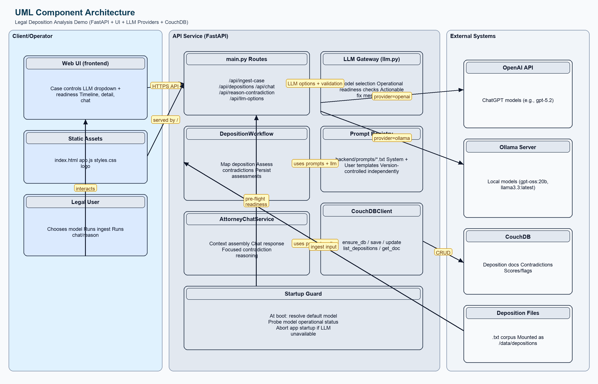
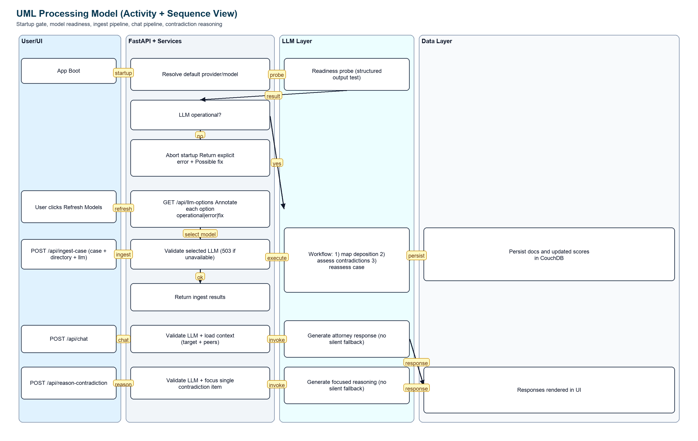

# Legal Deposition Analysis Demo

This demo ingests unstructured deposition `.txt` files for a case, maps each one into a deposition schema, stores it in CouchDB, evaluates contradictions across depositions, and exposes an interactive UI with risk scoring and attorney chat.

## Ollama Setup (Download Local LLMs)

Use these steps before running the app if you want local models through Ollama.

1. Install Ollama:
```bash
brew install --cask ollama
```

2. Start Ollama:
```bash
ollama serve
```

3. Pull one or more local models:
```bash
ollama pull llama3.3:latest
ollama pull gpt-oss:20b
```

4. Verify downloaded models:
```bash
curl http://localhost:11434/api/tags
```

5. Configure `.env` for this app:
```bash
# If running API on host:
OLLAMA_URL=http://localhost:11434

# If running API in Docker Compose:
OLLAMA_URL=http://host.docker.internal:11434

OLLAMA_DEFAULT_MODEL=llama3.3:latest
OLLAMA_MODELS=llama3.3:latest,gpt-oss:20b
DEFAULT_LLM_PROVIDER=ollama
```

6. Rebuild/restart the app after `.env` changes:
```bash
docker compose up --build -d
```

7. In the UI, click `Refresh Models` and choose an `Ollama - <model>` entry from the `LLM` dropdown.

8. Startup behavior:
   - The API fails fast if the default LLM cannot be reached at boot.
   - The startup error includes `Possible fix:` guidance.

## Workflow (LangGraph)

1. **Node 1 (Seasoned Law Clerk)**
   - Reads raw `.txt` deposition.
   - Extracts structured deposition schema using the selected LLM (default: `ChatGPT 5.2`, `MODEL_NAME=gpt-5.2`).
   - Saves mapped deposition to CouchDB.

2. **Node 2 (Seasoned Attorney)**
   - Compares the mapped deposition to other depositions in the same case.
   - Flags contradictions and assigns a `contradiction_score` (0-100).
   - Persists contradiction findings back to CouchDB.

## UML Diagrams

### 1. Component Architecture UML



This diagram shows:
- UI/frontend components and user interactions
- FastAPI service modules (`main.py`, workflow, chat, LLM gateway, prompts, CouchDB client)
- External systems (OpenAI, Ollama, CouchDB, deposition files)
- Startup guard dependency that blocks app boot when default LLM is not operational

### 2. Processing Model UML (Activity + Sequence)



This diagram shows:
- Startup readiness check and fail-fast path
- `Refresh Models` readiness annotation flow
- Ingest request processing (validation -> workflow -> persistence -> response)
- Chat and focused contradiction reasoning paths with strict LLM validation
- Response rendering path back to UI

To regenerate UML PNGs:

```bash
python scripts/generate_uml_diagrams.py
```

## Features

- Batch ingest all `.txt` files in a directory.
- Numeric contradiction risk scores per deposition (0-100), sorted highest-first.
- Scrollable deposition timeline with forward/back controls.
- Per-deposition contradiction details.
- Overall short-answer conflict summary plus clickable detail bullets for focused re-analysis.
- Attorney chatbot to explain conflicts and discuss possible actions.
- Runtime LLM switcher in the UI (ChatGPT or local Ollama models) for ingest, contradiction reasoning, and chat.
- Hard startup guard: API will not start unless the default configured LLM is operational.
- Optional fast-ingest mode to skip full-case reassessment and return results sooner.

## Tech Stack

- FastAPI backend
- LangGraph + LangChain OpenAI
- CouchDB storage
- Vanilla JS/CSS frontend
- Docker Compose for full local stack

## Quick Start (Docker Compose)

1. Configure environment:

```bash
cp .env.example .env
# required: set OPENAI_API_KEY
# optional: set DEPOSITION_DIR to a host folder with .txt files
# optional: change API_PORT / COUCHDB_PORT if 8000 or 5984 are in use
```

2. Build and start everything:

```bash
docker compose up --build -d
```

3. Open the app:

- UI: `http://localhost:8000` (or your configured `API_PORT`)
- CouchDB: `http://localhost:5984/_utils` (or your configured `COUCHDB_PORT`)

## UI

1. Top-left panel: case controls (`Case ID`, deposition folder, ingest, refresh, status).
   - Includes an `LLM` dropdown, `Refresh Models` button, and a `Fast ingest mode` checkbox.
2. Top-right panel: chronological deposition timeline with `Back` / `Forward` horizontal scrolling, plus a risk score list showing each deposition’s numeric contradiction score.
3. Bottom-left panel: `Overall Short Answer` for the selected deposition and clickable bullet detail items (clicking one triggers focused re-analysis for that single item).
4. Bottom-right panel: attorney chat that responds in short-answer + bullet-detail format.

## Using the Demo

1. Set a `Case ID`.
2. In `Deposition Folder`, use:
   - Docker Compose: `/data/depositions`
   - Local API process (non-Docker): `./sample_depositions` or an absolute host path
3. Click **Ingest .txt Depositions**.
4. Review contradiction scores and flagged depositions.
5. Use the timeline Back/Forward controls to move through depositions chronologically.
6. Select a deposition and click a contradiction detail bullet to re-analyze just that item.
7. Use the attorney chat panel to ask next-step questions.

## LLM Selection (ChatGPT + Ollama)

The UI lets you switch models at runtime from the `LLM` dropdown.

- `ChatGPT - <model>` entries use OpenAI.
- `Ollama - <model>` entries use your local Ollama server.

`Ingest`, `Attorney Chat`, and focused contradiction re-analysis all use the currently selected LLM option.

`Refresh Models` performs readiness checks. Models that are not operational are marked unavailable, and the app reports an error plus a suggested fix.
Regular dropdown loads use fast checks to avoid UI hangs; `Refresh Models` runs deeper operational probes (slower but stricter).

### Configure available models

Set these in `.env`:

```bash
# default OpenAI model used when provider is ChatGPT
MODEL_NAME=gpt-5.2

# comma-separated ChatGPT models shown in dropdown
OPENAI_MODELS=gpt-5.2,gpt-5.1-mini

# default provider on app load: openai or ollama
DEFAULT_LLM_PROVIDER=openai

# local Ollama server
OLLAMA_URL=http://localhost:11434

# fallback Ollama model when tags cannot be fetched
OLLAMA_DEFAULT_MODEL=llama3.3

# extra fallback local models (comma-separated)
OLLAMA_MODELS=llama3.3,mistral

# keep Ollama model loaded in memory between requests
OLLAMA_KEEP_ALIVE=10m

# readiness cache TTL for per-request validation (seconds)
# set 0 for strict probe on every request
LLM_READINESS_TTL_SECONDS=120

# full readiness probe timeout per model (seconds), used by Refresh Models
LLM_PROBE_TIMEOUT_SECONDS=12

# parallel workers for Refresh Models probing
LLM_OPTIONS_PROBE_WORKERS=3
```

### Using local models with Ollama

1. Start Ollama locally.
2. Ensure your model is downloaded, for example `llama3.3`.
3. Open the app and click `Refresh Models` to reload local tags.
4. Select the desired `Ollama - <model>` entry in the dropdown.

## Performance Tuning (Especially for llama3.3)

`llama3.3` is slower than smaller models because:

1. It is a larger local model, so token generation is slower on CPU or limited GPU.
2. Ingest includes map + contradiction assessment work for each deposition.
3. Full-case reassessment adds extra LLM calls after ingest.

Ways to reduce latency:

1. Enable `Fast ingest mode` in the UI to skip full-case reassessment during ingest.
2. Keep model weights warm with `OLLAMA_KEEP_ALIVE=10m` (or longer).
3. Increase/decrease validation probe frequency with `LLM_READINESS_TTL_SECONDS`:
   - Higher value: fewer readiness probes, faster requests.
   - `0`: strict probe every request (slowest, strictest).
4. Prefer smaller local models (for example `gpt-oss:20b`) when speed is more important than depth.

## Ingestion Folder Mapping

The API container mounts your host deposition directory to `/data/depositions`:

- Host path comes from `.env` key `DEPOSITION_DIR`.
- Container path is always `/data/depositions`.

Example:

- `DEPOSITION_DIR=./sample_depositions` (default)
- `DEPOSITION_DIR=/absolute/path/to/your/depositions`

If you run the API directly on host (without Docker), the ingest endpoint accepts local paths and also maps `/data/depositions` to your configured `DEPOSITION_DIR` when possible.

## API

- `POST /api/ingest-case`
- `GET /api/depositions/{case_id}`
- `GET /api/deposition/{deposition_id}`
- `POST /api/chat`
- `POST /api/reason-contradiction`
- `GET /api/llm-options`

`POST /api/ingest-case` accepts:

- `skip_reassess` (optional boolean, default `false`): when `true`, skips full-case reassessment for faster ingest.

## Prompt Files

System and user prompts are versioned separately from runtime code in:

- `backend/prompts/map_deposition_system.txt`
- `backend/prompts/map_deposition_user.txt`
- `backend/prompts/assess_contradictions_system.txt`
- `backend/prompts/assess_contradictions_user.txt`
- `backend/prompts/chat_system.txt`
- `backend/prompts/chat_user_context.txt`
- `backend/prompts/reason_contradiction_system.txt`
- `backend/prompts/reason_contradiction_user.txt`

Prompt loading/rendering logic lives in `backend/app/prompts.py`.

## Testing

Run the backend unit test suite locally:

```bash
pip install -r requirements-dev.txt
./scripts/run_tests.sh
```

`./scripts/run_tests.sh` prints console results and also writes:
- `reports/junit.xml` (JUnit-style XML)
- `reports/tests.html` (browser-friendly HTML report)

Open the HTML report locally:

```bash
open reports/tests.html
```

Use `reports/junit.xml` in CI systems that ingest JUnit output.

Current backend unit test files:
- `tests/test_config.py`
- `tests/test_models.py`
- `tests/test_couchdb.py`
- `tests/test_graph.py`
- `tests/test_chat.py`
- `tests/test_llm.py`
- `tests/test_prompts.py`
- `tests/test_main.py`

Run tests in Docker:

```bash
docker compose exec api pip install -r requirements-dev.txt
docker compose exec api ./scripts/run_tests.sh
```

## MCP CouchDB Access

This repo includes a local MCP server that exposes CouchDB deposition tools.

1. Start the stack:

```bash
docker compose up --build -d
```

2. Use the MCP server through the included demo client (inside Docker API container):

```bash
docker compose exec api python scripts/use_couchdb_mcp.py
```

3. Optional: run server directly on host (stdio transport):

```bash
python mcp_servers/couchdb_server.py
```

Available MCP tools:

- `list_case_depositions`
- `get_deposition`
- `list_flagged_depositions`
- `search_claims`
